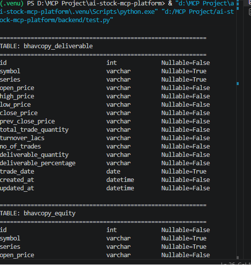
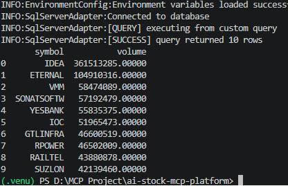
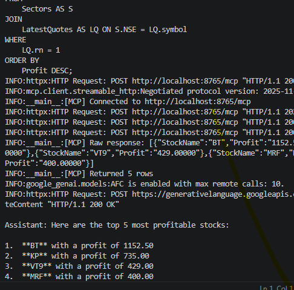

# 🚀 AI Stock MCP Platform | LangGraph + Gemini + FastMCP + SQL Server

## 📌 Overview

AI Stock MCP Platform is an AI-powered financial analytics platform that enables natural language interaction with stock market databases using Large Language Models (LLMs), LangGraph workflows, and the Model Context Protocol (MCP).

The platform combines Gemini, LangGraph, FastMCP, and SQL Server to automatically classify user intent, generate SQL queries, execute them securely against financial databases, and summarize results in natural language.

This project demonstrates how AI agents can interact with enterprise databases through MCP-based tool calling and schema-aware query generation.

---

## ✨ Key Features

### 🤖 AI & Agent Features

* Natural Language to SQL Generation
* LangGraph Agent Workflow
* Intent Classification
* Schema-Aware Query Generation
* AI-Powered Financial Question Answering
* Result Summarization
* MCP Tool Calling
* LangSmith Tracing & Observability
* Structured Agent Architecture

### 🗄️ Database Features

* SQL Server Integration
* Automatic Schema Discovery
* Secure Query Execution
* Query Timeout Handling
* DataFrame Conversion Support
* Database Metadata Retrieval

### 🔌 MCP Features

* MCP Server Implementation
* SQL Execution Tools
* Schema Retrieval Tools
* Financial Data Access via MCP
* AI-Agent Database Connectivity

---

## 🏗️ System Architecture

```text
User Query
     │
     ▼
LangGraph Workflow
     │
 ┌───────────────────────┐
 │  Intent Classification │
 └───────────────────────┘
            │
            ▼
 ┌───────────────────────┐
 │    SQL Generation     │
 └───────────────────────┘
            │
            ▼
 ┌───────────────────────┐
 │ MCP Tool Execution    │
 └───────────────────────┘
            │
            ▼
      SQL Server
            │
            ▼
 ┌───────────────────────┐
 │ Result Summarization  │
 └───────────────────────┘
            │
            ▼
      Final Response
```

---

## 📂 Project Structure

```text
backend/
│
├── data_loader/
│   ├── adapter/
│   │   └── ssms_adapter.py
│   │
│   └── common/
│       ├── environment.py
│       └── logger_factory.py
│
├── mcp_server/
│   └── server_socket.py
│
├── main.py
├── requirements.txt
│
├── Screenshots/
│
└── README.md
```

---

## ⚙️ LangGraph Workflow

The platform uses a multi-step AI workflow:

### 1️⃣ Intent Classification

Determines whether a user query can be answered directly or requires database retrieval.

Examples:

* "What is a stock?" → Direct Answer
* "Show top stocks by volume" → Database Query

### 2️⃣ SQL Generation

Generates schema-aware SQL Server queries using Gemini.

### 3️⃣ MCP Query Execution

Executes validated SQL through FastMCP tools.

### 4️⃣ Result Summarization

Converts database results into natural language responses.

---

## 🗄️ Database Schema Discovery

The platform automatically discovers:

* Tables
* Columns
* Data Types
* Nullable Fields

using the MCP schema retrieval tool.

### Example Tables

* bhavcopy_asm
* bhavcopy_deliverable
* bhavcopy_equity
* bhavcopy_live
* DailyAnalysis
* intra_day
* live_quote
* PreDefineSymbols
* Sectors
* securities
* StrongStart
* ZerodhaCandle
* ZerodhaHistorical
* ZerodhaTicks

---

## 🔌 MCP Tools

### execute_sqlserver_query()

Executes SQL queries securely against SQL Server.

### get_schema()

Retrieves database schema information.

### execute_query_to_dataframe()

Returns query results as Pandas DataFrames.

### get_data_retrieval()

Fetches table data for analysis and AI workflows.

---

## 📊 Example Questions

Users can ask questions in natural language:

* Show top 10 stocks by volume
* What is the latest price of Reliance?
* Which stocks have the highest delivery volume?
* Show top gainers today
* List the most active stocks
* Explain what volume means in stock trading

The system automatically determines whether to answer directly or query the database.

---

## 📸 Screenshots

## 📸 Application Screenshots

### Dynamic Database Schema Discovery

The MCP server automatically retrieves table metadata, column names, and schema information from SQL Server, enabling schema-aware query generation.



### Dynamic SQL Query Execution

Natural language requests are converted into SQL queries and executed through MCP tools against the stock market database.



### 🤖 AI Assistant Response

Example of the LangGraph + Gemini workflow processing a natural language stock market query, generating SQL, executing it through MCP, and returning a summarized response.



---

## 📌 Repository Note

This repository is provided for portfolio and educational purposes.

The project relies on a private stock market database, proprietary financial datasets, and environment-specific configurations that are not included in this repository.

For security, privacy, and licensing reasons, database credentials, API keys, and production data are excluded.

The source code, architecture, workflows, and screenshots are shared to demonstrate the implementation of:

* LangGraph-based AI workflows
* Natural Language to SQL generation
* MCP (Model Context Protocol) integration
* SQL Server connectivity
* AI-powered financial data analysis

Screenshots and documentation reflect the system running against a private stock market dataset.


---

## 🛠️ Technology Stack

### Programming

* Python

### Database

* SQL Server
* PyODBC

### AI & Agent Frameworks

* Gemini 2.5 Flash
* LangGraph
* LangChain
* LangSmith
* FastMCP
* Model Context Protocol (MCP)

### Data Analysis

* Pandas
* NumPy

### Visualization (Planned)

* Plotly
* Matplotlib
* Seaborn

---

## 🚀 Future Roadmap

### Completed ✅

* SQL Server Integration
* FastMCP Integration
* Schema Discovery
* Natural Language to SQL
* LangGraph Workflow
* Gemini Integration
* MCP Tool Calling
* Result Summarization

### Planned 🔄

* Multi-Agent Financial Analysis
* Portfolio Analytics
* Technical Indicator Generation
* Interactive Dashboards
* Stock Recommendation Engine
* Real-Time Market Monitoring

---

## 🎯 Learning Outcomes

This project demonstrates:

* AI Agent Development
* LangGraph Workflow Design
* MCP Server Development
* LLM Tool Calling
* Natural Language to SQL Systems
* Database Integration for AI Applications
* Financial Data Analytics
* Production-Oriented Backend Architecture

---

## 👨‍💻 Author

**Akash Kumar Barnwal**

AI Engineer | Data Scientist

* GitHub
* Kaggle
* LinkedIn
* LeetCode
