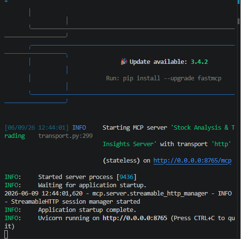

# 🚀 AI Stock MCP Platform


**Natural Language → SQL → MCP Tools → SQL Server → AI-Powered Insights**

---

## 📌 Overview

AI Stock MCP Platform is a natural language interface for stock market databases. It combines Gemini, LangGraph, FastMCP, and SQL Server to enable users to query financial data in plain English without writing SQL.

---

## 🎯 Problem Statement

Financial data is often stored across multiple database tables, requiring users to understand database schemas and write complex SQL queries to retrieve meaningful insights. This creates a barrier for analysts, traders, and business users who need quick access to market information.

This project addresses that challenge by enabling natural language interaction with stock market databases. The platform automatically understands user intent, generates schema-aware SQL queries, retrieves relevant data through MCP tools, and returns business-friendly insights in natural language.


---

## ✨ Key Features

### 🤖 AI & Agent Capabilities

* Natural Language to SQL Generation
* Intent Classification
* LangGraph Agent Workflow
* Schema-Aware Query Generation
* MCP Tool Calling
* Result Summarization
* LangSmith Tracing & Observability

### 🗄️ Database Integration

* SQL Server Connectivity
* Automatic Schema Discovery
* Secure Query Execution
* Query Timeout Handling
* DataFrame Conversion Support

### 🔌 MCP Features

* MCP Server Implementation
* SQL Execution Tools
* Schema Retrieval Tools
* Financial Data Access via MCP

---

## 🏗️ System Architecture

```text
User Query
    ↓
LangGraph Workflow
    ↓
Intent Classification
    ↓
SQL Generation
    ↓
MCP Tool Execution
    ↓
SQL Server
    ↓
Result Summarization
    ↓
Final Response
```

---

## 📸 Screenshots

### MCP Server Running

FastMCP server providing schema retrieval and SQL execution tools.




### AI Assistant Response

Example of the LangGraph + Gemini workflow processing a natural language stock market query and returning a summarized response.


---

## 🔌 MCP Tools

| Tool                           | Purpose                             |
| ------------------------------ | ----------------------------------- |
| `get_schema()`                 | Retrieve database schema            |
| `execute_sqlserver_query()`    | Execute SQL queries                 |
| `execute_query_to_dataframe()` | Return results as Pandas DataFrames |
| `get_data_retrieval()`         | Fetch data for analysis             |

---

## 📊 Example Questions

Users can ask questions in natural language:

* Show top 10 stocks by volume
* What is the latest price of Reliance?
* Which stocks have the highest delivery volume?
* Show top gainers today
* List the most active stocks
* Explain what volume means in stock trading

The system automatically determines whether to answer directly or retrieve information from the database.

---

## 📂 Project Structure

```text
backend/
│
├── data_loader/
│   ├── adapter/
│   │   └── ssms_adapter.py
│   │
│   └── common/
│       ├── environment.py
│       └── logger_factory.py
│
├── mcp_server/
│   └── server_socket.py
│
├── main.py
├── requirements.txt
│
├── Screenshots/
│
└── README.md
```

---

## 🛠️ Technology Stack

### Programming

* Python

### AI & Agent Frameworks

* Gemini 2.5 Flash
* LangGraph
* LangChain
* LangSmith
* FastMCP
* Model Context Protocol (MCP)

### Database

* SQL Server
* PyODBC

### Data Processing

* Pandas
* NumPy

---

## 📌 Repository Note

This repository is shared for portfolio and educational purposes.

The production database, credentials, API keys, and proprietary stock market datasets are not included. Screenshots and documentation demonstrate the system operating on a private financial dataset.

---

## 🎯 Learning Outcomes

This project demonstrates:

* AI Agent Development
* LangGraph Workflow Design
* MCP Server Development
* LLM Tool Calling
* Natural Language to SQL Systems
* SQL Server Integration
* Financial Data Analytics
* Production-Oriented Backend Architecture

---

## 👨‍💻 Author

**Akash Kumar Barnwal**

AI Engineer | Data Scientist

* GitHub: https://github.com/barnwalakash60973-pixel
* LinkedIn: https://www.linkedin.com/in/akash-kumar-barnwal-31968a380/
